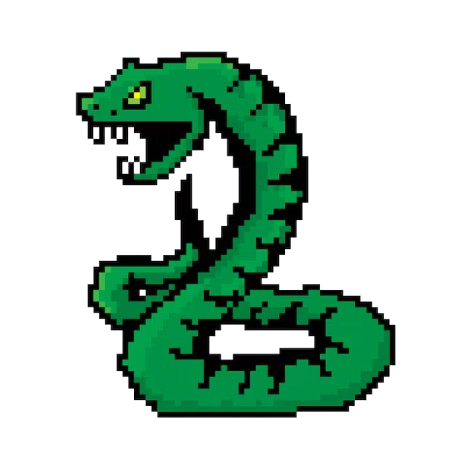

# Snake Game AI Project 
## Overview
This project focuses on developing an AI model that learns to play a custom-built Snake game using Reinforcement Learning (RL). The game is implemented using Pygame, and the AI agent is trained to optimize its strategy based on the rewards and penalties defined in the game.

The goal is to enable the AI to play the game autonomously by training it through multiple episodes, where it learns to avoid obstacles, collect food, and grow the snake while maximizing its score.
## Features
- Custom Snake Game: A dynamic Snake game with configurable difficulty levels and walls.

- Reinforcement Learning (RL) Model: Uses DQN (Deep Q-Learning) to train the AI to learn optimal gameplay.

- Game States: The game state is represented in a matrix that the AI uses as input for decision-making.

- Performance Tracking: The game tracks the highest score (best record) and saves it for future reference.

- Model Saving: The trained AI model is saved after training for future gameplay or fine-tuning.

## Screenshots
<div style="display: flex; justify-content: space-between;">
  
  
</div>

## Deep Reinforcement Learning Overview
This project teaches an AI agent to play a custom **Snake** game with **Deep Reinforcement Learning (DQN)**.  
The game uses **Pygame** for rendering and a lightweight, Gym-style **`SnakeEnv`** for training and evaluation.

- **RL algorithm:** DQN (PyTorch)
- **Interface:** Gymnasium-compatible environment
- **Play styles:** Human (arrow keys) or AI agent
- **Board edges:** Configurable — **wrap-around** (toroidal) *or* **no-wrap** (borders are death)

---

## Repository Structure
Game (your originals):
- `settings.py` – screen size, cell size, colors, etc.
- `snake.py` – snake logic (movement, growth, self-collision).
- `food.py` – food placement.
- `walls.py` – wall generation/management.
- `ui.py` – renderer.
- `game.py` / `main.py` – human-playable game loop.

RL (added for training/visualization):
- `env_snake.py` – Gym-style environment that wraps the game logic.
- `dqn_agent.py` – DQN network, replay buffer, target net updates.
- `train_dqn.py` – training loop with CSV + TensorBoard logging.
- `eval_dqn.py` – watch the trained agent play (windowed).
- `logger.py` – simple CSV logger.
- `plot_training.py` – plots returns, epsilon, loss from the CSV logs.

> If any file paths point to `/mnt/data/...`, you can safely change them to **relative paths** on your machine (e.g., `runs/snake_dqn/` and `models/dqn_snake.pt`).

---

## Features
- **Difficulty presets:** `easy (0 walls)`, `normal (15 walls)`, `hard (45 walls)` — or pass a custom wall count.
- **Wrap toggle:** choose between **wrap-around** or **no-wrap** borders during evaluation.
- **Action space (3):** relative control — `straight`, `left`, `right` (prevents illegal 180° turns).
- **Observation (11-dim):**
  - danger: ahead / left / right
  - heading one-hot: up / down / left / right
  - food direction one-hots: up / down / left / right
- **Rewards:**
  - `+1.0` eat food
  - `-1.0` death (self or wall/border)
  - `-0.01` per step (time penalty)
  - `±0.01` shaping if moving closer/farther from food
- **Training logs & viz:** CSV + TensorBoard + Matplotlib plots.
- **Model saving:** checkpoints for later evaluation or fine-tuning.

> Note: An alternative **grid/CNN** observation can be added later if you want pixel/board inputs instead of the 11-dim features.

---

## Setup
```bash
pip install torch gymnasium pygame numpy pandas matplotlib tensorboard
```

If `gymnasium` is unavailable, the environment falls back to minimal stubs so training still works headless.

---

## Train
```bash
python train_dqn.py
```
Defaults (can be edited in the script):
- episodes: `800`
- difficulty: `wall_count=15` (normal)
- patience (steps allowed without eating): `250`
- logging: `runs/snake_dqn/log.csv` (+ TensorBoard events)
- model: `dqn_snake.pt`

**Visualize training:**
```bash
# live dashboard
tensorboard --logdir runs/snake_dqn

# static plots (PNG files)
python plot_training.py
```
This generates `training_returns.png`, `epsilon_decay.png`, and `loss_curve.png` in a `training_plots/` folder (or wherever configured).

---

## Evaluate (watch the agent play)
```bash
# Named difficulty presets
python eval_dqn.py --difficulty easy     # walls=0
python eval_dqn.py --difficulty normal   # walls=15
python eval_dqn.py --difficulty hard     # walls=45

# Or explicit wall count
python eval_dqn.py --wall-count 45

# Episodes and model path
python eval_dqn.py --difficulty normal --episodes 5 --model dqn_snake.pt

# Treat borders as death (disable wrap-around)
python eval_dqn.py --difficulty normal --no-wrap
```

If a window does not open on your machine:
- Make sure you’re **not** setting `SDL_VIDEODRIVER=dummy`.
- Don’t run under WSL/SSH without an X server.

---

## Tips & Next Steps
- If you switch to **no-wrap borders**, it’s best to **retrain** with no-wrap (the policy changes).
- Curriculum training often helps: start with `walls=0` → `15` → `45`.
- You can increase the network size in `dqn_agent.py` for more capacity.
- Want a **CNN** over a board grid? We can add a matrix observation + tiny CNN and compare.

---

## Tech Stack
- **Pygame** — rendering and game loop.
- **NumPy** — math helpers.
- **PyTorch** — neural network + DQN training.
- **Gymnasium** — standard RL API (optional; env also runs without it).
- **Matplotlib / Pandas / TensorBoard** — training visualization & logs.

---

## Acknowledgements
This repo combines a user-friendly Snake game with a minimal, production-ready RL training pipeline to make experimentation easy.


This project utilizes the following libraries:

- Pygame - For creating the Snake game environment, handling graphical rendering, user input, and the game loop.

- NumPy - For handling matrix operations and representing the game state, making it easier to manipulate and pass to the AI model.

- TensorFlow or PyTorch - Deep learning frameworks used to build and train the Reinforcement Learning (RL) model.

- OpenAI Gym - Provides a simple interface for developing and comparing RL algorithms. The custom SnakeEnv class wraps the game for RL training.

- Matplotlib - Optional, for visualizing training results and performance trends over time.

- Pandas - For logging game results (scores and metrics) in a CSV format.

- Scikit-learn - Optional, provides tools for training and evaluating machine learning models and RL algorithms.
